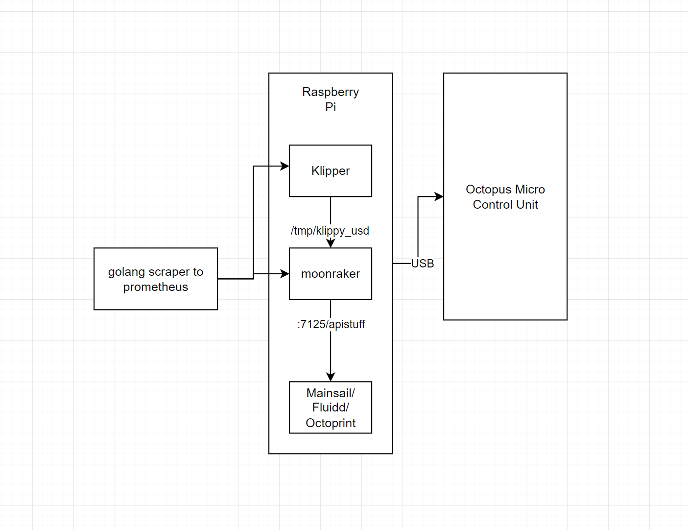

# Documentation sources
https://www.klipper3d.org/API_Server.html
Documentation for extracting data from klipper 
https://docs.octoprint.org/en/master/api/index.html
Documentation for extracting data from octoprint
https://prometheus.io/docs/guides/go-application/
Document for exporting/exposing prometheus metrics

# Development documentation
http://192.168.20.230:7125/access/api_key - get moonraker key

